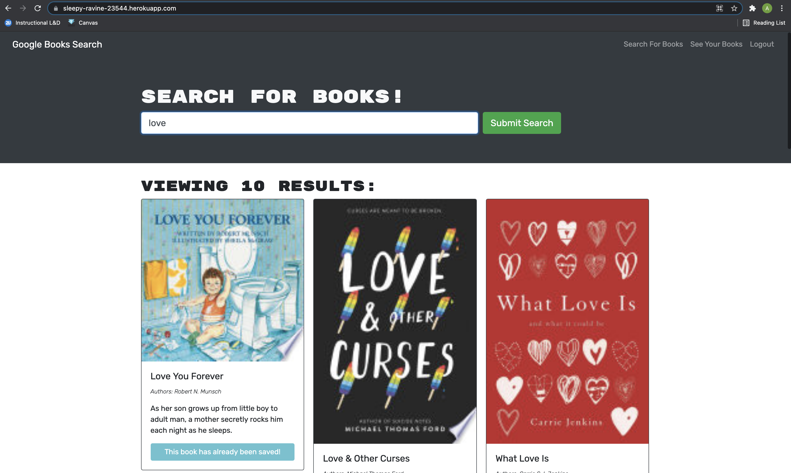

# [Book Search](https://sleepy-ravine-23544.herokuapp.com/){:target="_blank"}
Where you can save your favorite books to a list and view them!

# Setup dev environment
 - `brew install mongo`
 - `npm run start:mongo`
 - `npm run install` will install all dependencies across frontend and backend
 - `npm run develop` will start the development servers (frontend and backend) and watch for file changes in both

# To deploy
 - git add, commit, push to main
 - `npm run deploy`
 
